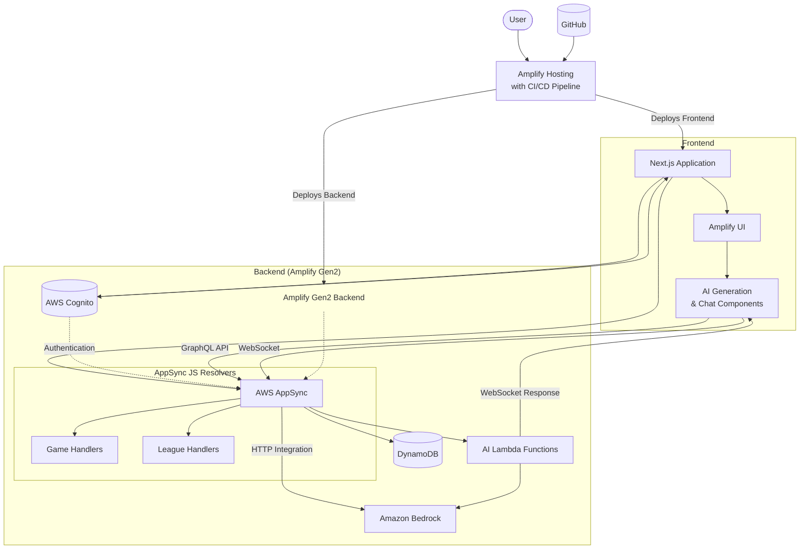

This is an [AWS Amplify](https://aws.amazon.com/amplify/) with [Next.js](https://nextjs.org) project bootstrapped with [`create-next-app`](https://nextjs.org/docs/app/api-reference/cli/create-next-app).

## Getting Started

First, install the dependencies:

```bash
npm install
```

This project uses [API-Football](https://rapidapi.com/api-sports/api/api-football) to get football data. You need to sign up and get an API key. Store your API key in the `RAPID_API_KEY` as a secret for Amplify.

```bash
npx ampx sandbox secret set RAPID_API_KEY
```

Then, deploy the cloud infrastructure on AWS sandbox:

```bash
npx ampx sandbox
```

Then, run the development server:

```bash
npm run dev
```

Open [http://localhost:3000](http://localhost:3000) with your browser to see the result.

You can start editing the page by modifying `app/page.tsx`. The page auto-updates as you edit the file.

This project uses [`next/font`](https://nextjs.org/docs/app/building-your-application/optimizing/fonts) to automatically optimize and load [Geist](https://vercel.com/font), a new font family for Vercel.

## Architecture



## AWS China Region Deployment

If you need to deploy this application to AWS China regions, check out the [`aws-china-migration`](https://github.com/zxkane/game-match-playground/tree/aws-china-migration) branch which contains specific adaptations:

1. **External Authentication**: Uses external OIDC provider for authentication instead of Cognito User Pool (not available in China regions)
2. **AppSync Authentication**: Configures AppSync to work with the external OIDC provider
3. **UI Modifications**: Disables Amplify UI features that depend on Amazon Bedrock (not available in China regions)
4. **CDK-Based Deployment**: Uses AWS CDK with Lambda Web Adapter and API Gateway instead of Amplify Hosting

The `aws-china-migration` branch includes a comprehensive architecture diagram and detailed setup instructions for deploying to AWS China regions.

## Learn More

To learn more about Next.js, take a look at the following resources:

- [AWS Amplify Documentation](https://docs.aws.amazon.com/amplify/latest/userguide/what-is-amplify.html) - learn about AWS Amplify features and API.
- [Next.js Documentation](https://nextjs.org/docs) - learn about Next.js features and API.
- [Learn Next.js](https://nextjs.org/learn) - an interactive Next.js tutorial.

You can check out [the Next.js GitHub repository](https://github.com/vercel/next.js) - your feedback and contributions are welcome!

## Deploy on Amplify Hosting

View the [Amplify Hosting](https://docs.aws.amazon.com/amplify/latest/userguide/getting-started.html) documentation for more information.
