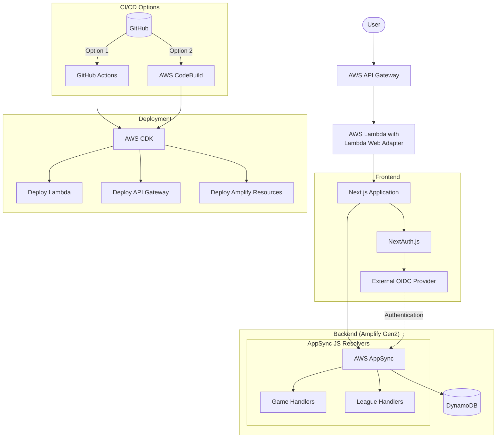

# Next.js with AWS Lambda Web Adapter - AWS China Region Migration

This branch demonstrates how to deploy a Next.js application to AWS Lambda in China regions using the AWS Lambda Web Adapter. The application is deployed to AWS API Gateway + Lambda, while using Amplify for backend services with specific adaptations for AWS China regions.

## China Region Adaptations & Migration Features

This branch contains specific modifications to support deployment in AWS China regions:

1. **External Authentication**: Amplify Gen2 no longer manages authentication as AWS China doesn't provide Cognito User Pool. Instead, an external OIDC provider is used for authentication.

2. **AppSync Authentication**: The external OIDC provider is used to authenticate with AppSync services.

3. **Disabled Amplify UI Features**: Amplify UI features that are tightly coupled with Amazon Bedrock (which is not available in China regions) have been disabled.

4. **CDK-Based Deployment**: Implements a custom CDK project (`cdk-deployment`) to deploy the Next.js application to Lambda using the AWS Lambda Web Adapter, replacing Amplify Hosting which has limitations in China regions.

5. **Alternative CI/CD Options**: 
   - **AWS CodeBuild**: The deployment process can be migrated to AWS CodeBuild pipelines
   - **GitHub Actions**: Workflows can be set up to automate the CDK deployment process
   
   Both options serve as alternatives to the Amplify CI/CD pipeline that's used in the main branch.

## Architecture




## Prerequisites

- Node.js 20.x
- AWS CLI configured for cn-north-1 region
- AWS CDK installed
- Docker installed

## Project Structure

- `/src`: Next.js application code
- `/amplify`: Amplify Gen2 backend code
- `/cdk-deployment`: CDK application for deploying to AWS

## Local Development

### 1. Configure Environment Variables

Update the `.env.production` file with your actual configuration values:

```
AWS_REGION=cn-north-1
AWS_PROFILE=your-aws-profile-to-access-cn-north-1

OIDC_CLIENT_ID=your-client-id
OIDC_CLIENT_SECRET=your-client-secret
OIDC_ISSUER_URL=your-issuer-url

NEXTAUTH_URL=http:/localhost:3000
NEXTAUTH_SECRET=your-nextauth-secret
```

### 2. Deploy the AWS infrastructure managed by Amplify Gen2

```bash
npm install
npx ampx sandbox
```

### 3. Run the frontend application locally

```bash
npm install
npm run dev
```

## Deployment

### 1. Follow the local development steps 1 and 2

### 2. Deploy the frontend application with CDK

```bash
bash ./deploy.sh
```

After deployment, the CDK will output the API Gateway URL, which you can use to access your application.

### 3. Update Environment Variables

After deployment, update the below environment variable with the actual API Gateway URL:

```
NEXTAUTH_URL=https://<api id>.execute-api.cn-north-1.amazonaws.com.cn/
```
### 4. Re-deploy the frontend application with CDK

```bash
bash ./deploy.sh
```

### 5. Add the portal URL to the OIDC client redirect URIs

### 6. Access the application

Access the application using the API Gateway URL.